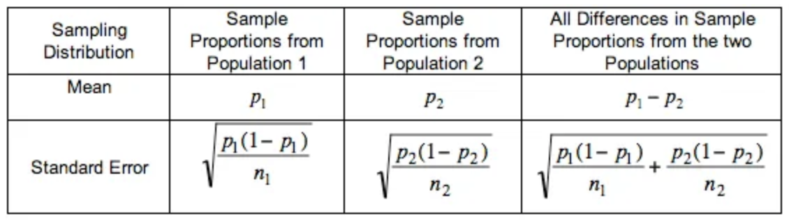

# ab_testing

This repo contains related contents from Udacity A/B Testing final project

Experiment doc: https://docs.google.com/document/u/1/d/1aCquhIqsUApgsxQ8-SQBAigFDcfWVVohLEXcV6jWbdI/pub

## 1. Project Challenge
- The goal of the experiment is to compare the two options of course overview page: 'start a free trial' versus 'access course materials'.
- If students choose to 'start a free trial', they will need to enter payment information, and then they are enrolled to the paid version of the course with a 14-day free trial upfront. Their card will be automatically charged after the free trial.
- If students choose to 'access course materials', they will use the free version of the course without receiving a verified certificate or accessing coaching.

**Reasoning**: The hypothesis is that this might set clearer expectations for students upfront, thus reducing the number of frustrated students who left the free trial because they didn't have enough time—without significantly reducing the number of students to continue past the free trial and eventually complete the course.

## 2. Experiment Design
Unit of diversion: cookie. Although if the student enrolls in the free trial, they are tracked by user-id from that point forward. The same user-id cannot enroll in the free trial twice. For users that do not enroll, their user-id is not tracked in the experiment, even if they were signed in when they visited the course overview page.

### 2.1 Initial hypotheses
1)  
- H0: The treatment has no effect on the share of people who enroll in the free trial
- H1: The treatment reduces the share of people who enroll in the free trial

2)  
- H0: The treatment has no effect on the share of people who leave the free trial
- H1: The treatment improves the overall student experience thereby reducing the share of people who leave the free trial

3)  
- H0: The treatment has no effect on the number of people who continue after the free trial
- H1: The treatment affects the number of people who continue past the free trial

### 2.2 Metric choice
**Invariate metrics**: number of cookies, number of clicks, click through probability  
- Number of cookies: That is, number of unique cookies to view the course overview page. (d_min=3000)
- Number of clicks: That is, number of unique cookies to click the "Start free trial" button (which happens before the free trial screener is trigger). (d_min=240)
- Click-through-probability: That is, number of unique cookies to click the "Start free trial" button divided by number of unique cookies to view the course overview page. (d_min=0.01)

**Evaluation metrics**: gross conversion, retention, net conversion
- Gross conversion: That is, number of user-ids to complete checkout and enroll in the free trial divided by number of unique cookies to click the "Start free trial" button. (d_min= 0.01)
- Retention: That is, number of user-ids to remain enrolled past the 14-day boundary (and thus make at least one payment) divided by number of user-ids to complete checkout. (d_min=0.01)
- Net conversion: That is, number of user-ids to remain enrolled past the 14-day boundary (and thus make at least one payment) divided by the number of unique cookies to click the "Start free trial" button. (d_min= 0.0075)

The altimate goal is to improve the overall student experience and improve coaches' capacity to support students who are likely to complete the course. In the experiment.
- Increase Retention, i.e, more users enroll in free trial and make at least one payment out of users who complete checkout. 
- Increase net conversion and decrease gross conversion, i.e, with less students starting free trial but more students make at least one payment after 14-day boundary of free trial. So d_min of gross conversion is -0.01

**Unused metrics**: number of users
- Number of user-ids: That is, number of users who enroll in the free trial. (d_min=50)

User-id is not used as an invariant metric or evaluation metric. User ids are only tracked after enrollment of free trial. It will be equally distributed between the control group and the experiment group. It will not provide any additional information compared to gross conversion and thus is not a good evaluation metric. As we expect to see less users after free trial ends, d_min = -50.

### 2.3 Revisited hypotheses
1)  
- H0: Gross Conversion_exp = Gross Conversion_cont
- H1: The treatment reduces the share of people who enroll in the free trial

2)  
- H0: Retention_exp = Retention_cont
- H1: The treatment improves the overall student experience thereby reducing the share of people who leave the free trial

3)  
- H0: Net Conversion_exp = Net Conversion_cont
- H1: The treatment affects the number of people who continue past the free trial

## 3. Measure of variability in metrics
Analytical Estimate of Standard Deviation of Evaluation Metrics.

### 3.1 Scaling
Since the unit size given by Udacity is n = 5000 cookies, we first need to scale the collected count data, i.e. the number of cookies, the number of clicks and the number of user-ids.

Scaling factor = n_sample_of_cookies / n_cookies_baseline

### 3.2 Analytical standard error
$SE=\sqrt{\frac{\hat p(1-\hat p)}{n}}$ 
Gross Conversion (clicks):  0.0202, Retenstion (enrolls): 0.0549, Net conversion (clicks): 0.0156

### 3.3 Determine sample size
Calculate the sample size for the selected evaluation metrics, use alpha = 0.05 and beta = 0.2.

Number of clicks/enrollments using sample size calculator -> Number of pageviews required (use the ratio conversion) -> Three metrics, use the largest number of pageviews -> 741212

### 3.4 Experiment duration and exposure
Number of pageviews, fraction of traffic exposed, length of experiment. 

If we divert 100% of the traffic, given 40,000 pageviews per day, the experiment will take 119 days. This is too long for an experiment. If we eliminate retention and only care about gross conversion and net conversion, and divert 100% of the traffic, we only need 18 days. If we divert 80% of traffic to the experiment, we need 22 days.

In conclusion, we drop the retention and use the gross conversion and net conversion as the evaluation metrics. 

## 4. Sanity Checks
For each invariant metric 1) number of cookies, 2) number of clicks, 3) ctp, compute a 95% confidence interval for the value you expect to observe and see if it passes the sanity check. 
- Count metrics (invariant metrics): expect the total number of cookies and clicks in the control group and the experiment group to be 50% each. SE=sqrt(p(1-p)/n).
    - Cookies and clicks pass the sanity check.
- To perform sanity check for the Click Through Probability, we would expect that the difference between the two groups be zero.
    - CTP passes sanity check.

For evaluation metrics 

## 5. Effect Size Tests
After the sanity check, we will continue examinate the evaluationi metrics. We want to check whether each metric is statically or practically significant on 95% confidence interval.
- An evaluation metric is statistically significant if the CI does not include 0 (that is, you can be confident there was a change)
- An evaluation metric is practically significant if the CI does not include the practical significance boundary (that is, you can be confident there is a change that matters to the business.)

As we use gross conversion and net conversion as the evaluation metrics, we know that d_min=0.01 for gross conversion, and d_min=0.075 for net conversion.

Gross Conversion is both Statistically and Practically significant while Net Conversion is only Practically Significant.

## 6. Sign Tests
The sign test is to check whether the signs of the difference of the metrics between the experiment group and control group agree with the confidence interval of the difference. Run a sign test on each of your evaluation metrics using the day-by-data data. Setting probability as 0.5.
- For Gross Conversion, experience group are higher than control groups for 4 times out of 23, p-value=0.0026, which is significant.
- For Net Conversion, experience group are higher than the control group for 10 times out of 23, p-value=0.6776, that is not significant.

## 7. Recommendations
The goal of the project is to help Udacity find students who will not commit to study, while not reducing the number of students who are willing to make payments after the free trial. With the designed experiment to give students who are committed to study for over 5 hours a week a free 14-day trial with automatic payments afterwards. The final results show that Gross Conversion (Enrollments/Clicks) will be reduced significantly in the experiment group. However, Net Conversion (Payments/Clicks) has no significant changes between experiment group and control group.

So we can conclude the new feature will help reduce enrollments, but we don't have evidence thst the payments will reduce in the mean time. My recommendation is not to luanch the experiment. We could use a follow-up experiment to determine where the number of payment cancellation will reduce within the first 14 days, using no free trial as a control, and free trial as an experiment. 